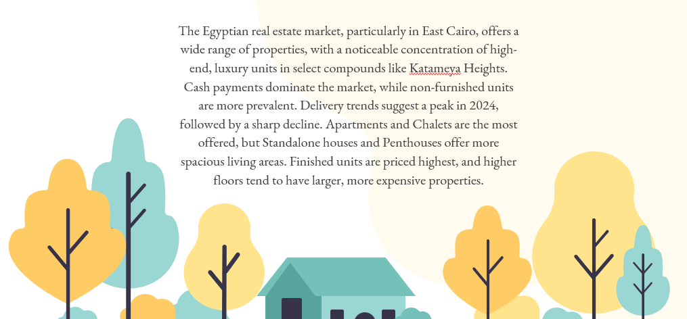

# Depi-Graduation (Real Estate Analysis)
# Egyptian Real Estate Market Analysis

**Data Cleaning and Preparation**

The [raw dataset](egypt_House_prices_Original.xlsx) underwent significant cleaning and transformation using Microsoft Excel and Power BI:

1. **Region Mapping:** A new "Region" column was added, mapping cities to specific regions.
2. **Data Accuracy:** Blank cells were filled, and data inconsistencies were corrected.
3. **Data Type Conversion:** Data types were adjusted for accurate analysis.
4. **Column Renaming:** Columns were renamed for better clarity.
5. **Index Column Addition:** An Index column was added to track the number of property offers.
6. **Data Filtering:** Rows with missing or inaccurate data were removed.
7. **Delivery Date Estimation:** Missing delivery dates were estimated based on the "Delivery Term" column.

**Data Analysis and Visualisations**

The cleaned data was analyzed using Microsoft Power BI to create a dynamic dashboard. Key insights were uncovered:

* **Price Influencers:** Property type, location, and features significantly impact prices.
* **Demand Trends:** Apartments and chalets are highly demanded, with a peak in deliveries expected in 2024.
* **Payment Preferences:** Cash payments are the primary payment method.
* **Furnishing Status:** Non-furnished properties are more common.

The analysis highlights key trends in the Egyptian real estate market, particularly the dominance of East Cairo and the popularity of certain property types. These insights can aid both buyers and sellers in making informed decisions.

**Repository Contents**

* Cleaned dataset
* Power BI dashboard file (.pbix)
* Documentation on data cleaning and analysis steps

**Future Work**

* Expand the analysis to incorporate more variables and data points.
* Develop predictive models to forecast future market trends.

